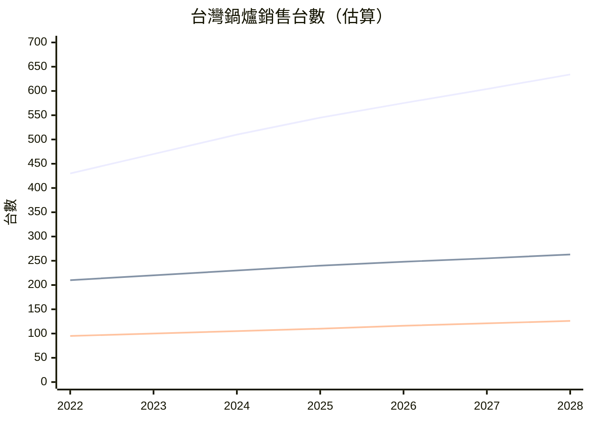
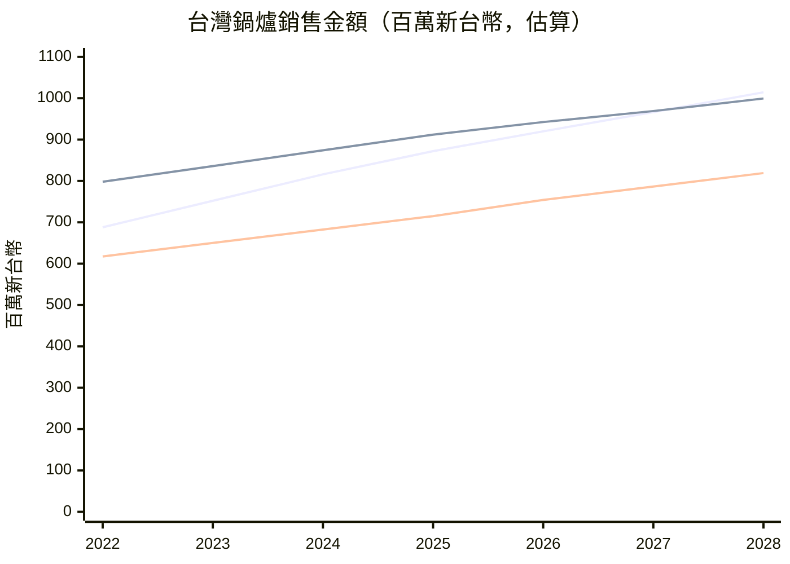

# 台灣鍋爐三類型銷售（估算）圖表

> 註：此圖使用 `data/boiler_sales_estimate_tw_2022_2028.csv`，2027、2028 為預估值。

## 1) 銷售台數（2022-2028）

```mermaid
xychart-beta
    title "台灣鍋爐銷售台數（估算）"
    x-axis [2022, 2023, 2024, 2025, 2026, 2027, 2028]
    y-axis "台數" 0 --> 700
    line "貫流式" [430, 470, 510, 545, 575, 604, 634]
    line "煙管式蒸汽" [210, 220, 230, 240, 248, 255, 263]
    line "水管式蒸汽" [95, 100, 105, 110, 116, 121, 126]
```

## 2) 銷售金額（百萬新台幣，2022-2028）

```mermaid
xychart-beta
    title "台灣鍋爐銷售金額（百萬新台幣，估算）"
    x-axis [2022, 2023, 2024, 2025, 2026, 2027, 2028]
    y-axis "百萬新台幣" 0 --> 1100
    line "貫流式" [688, 752, 816, 872, 920, 966.4, 1014.4]
    line "煙管式蒸汽" [798, 836, 874, 912, 942.4, 969, 999.4]
    line "水管式蒸汽" [617.5, 650, 682.5, 715, 754, 786.5, 819]
```
